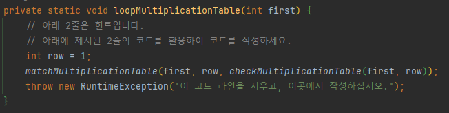
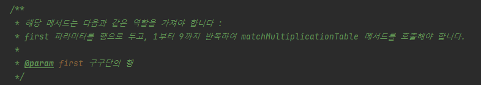
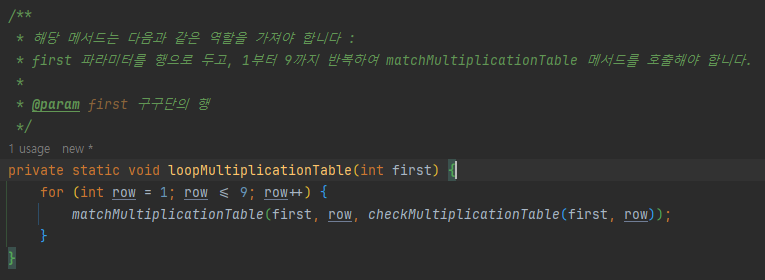

## 자바프로그래밍 실습 2번째 프로젝트

2번째 실습 시간에 참가하신 여러분을 환영합니다.

자바프로그래밍 실습은 [이전 프로젝트]()처럼 구동하거나, 현재 프로젝트처럼 직접 구현해보는 형태로 나뉩니다.

직접 구현해야하는 프로젝트는 각 설명 페이지에 해당 실습 강의의 목표가 적혀 있습니다.

구현해야 하는 프로젝트는 다음과 같이, 소스 코드에 RuntimeException을 통해 코드의 작동이 불가능하도록 되어있습니다.

 

예제의 코드와 같이, 예외가 발생하여 작동이 불가능한 코드에는 목표에 대한 설명이 주석으로 존재합니다.

 

해당되는 주석을 읽고, 목표에 맞게 코드를 구현해보세요. 입력되어있는 예외는 코드의 구동을 막기 위해 존재하며, 지워도 문제가 없습니다.

 

실습 프로젝트는 난이도별로 문제를 설계하였으며, 해당 프로젝트는 다음의 순서로 풀어보는것을 추천합니다 : 

- ScoreAverage
- ForWhileIteration
- MultiplicationTableIteration
- DoWhileIteration

실습 완료 후, 각 프로젝트는 실습 완료 확인을 위해 깃허브에 코드를 커밋 후, 링크를 skywolf461@gmail.com으로 전송해야 합니다.

